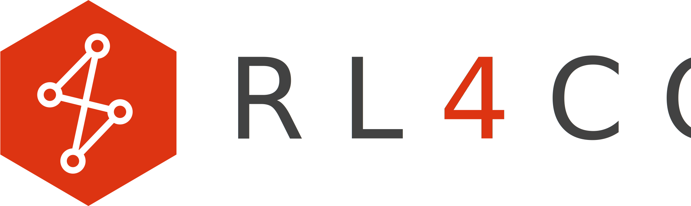

---
hide:
- navigation
- toc
--- 

<div>                        
<style type="text/css">
.md-typeset h1,
.md-content__button {
    display: none;
}
</style>      
</div> 

<style>
.rl4co-letters {
    fill: #424242;
}
.rl4co-number {
    fill: #dd3412;
}
</style>

<div class="md-content" data-md-component="content">
  <article class="md-content__inner md-typeset">
    <!-- Assuming this is where the main content begins -->
    <div id="particles-container-main" class="md-main__inner md-content" data-md-content="main">
        <script src="docs/js/tsparticles.js"></script>
        <style>
            .md-main__inner #particles-container {
                width: 100%;
                position: relative;
                overflow: hidden;
            }
            .md-main__inner #tsparticles {
                width: 100%;
                height: 100%;
                position: absolute;
                top: 0;
                left: 0;
                opacity: 0;
                transition: opacity 0.5s ease-in-out;
            }
            .md-main__inner #particles-mask {
                position: absolute;
                top: 0;
                left: 0;
                right: 0;
                bottom: 0;
                pointer-events: none;
                z-index: 5;
            }
            .md-main__inner #logo-overlay {
                position: absolute;
                top: 50%;
                left: 50%;
                transform: translate(-50%, -50%);
                z-index: 10;
                width: 60%;
                height: auto;
                opacity: 0;
                transition: opacity 0.5s ease-in-out;
            }
            .md-main__inner .loading-indicator {
                position: absolute;
                top: 50%;
                left: 50%;
                transform: translate(-50%, -50%);
                font-size: 24px;
                color: #333;
            }
            @media (max-width: 768px) {
                .md-main__inner #gradient {
                    height: 50px;
                }
            }
        </style>
        <div id="particles-container">
            <div class="loading-indicator">Loading...</div>
            <div id="tsparticles"></div>
            <div id="particles-mask"></div>
            
            <div id="gradient"></div>
        </div>

        <script>
            (async () => {
                const IMAGE_WIDTH = 3200;
                const IMAGE_HEIGHT = 955;
                const ASPECT_RATIO = IMAGE_HEIGHT / IMAGE_WIDTH;

                const setContainerDimensions = () => {
                    const container = document.querySelector('.md-main__inner #particles-container');
                    const mainContent = document.querySelector('.md-main__inner');
                    
                    if (mainContent && container) {
                        const containerWidth = mainContent.offsetWidth;
                        container.style.width = `${containerWidth}px`;
                        
                        // Calculate height based on the aspect ratio and 60% width
                        const imageWidth = containerWidth * 0.6;
                        const imageHeight = imageWidth * ASPECT_RATIO;
                        container.style.height = `${imageHeight * 2}px`;
                    }
                };

                const setMaskGradient = () => {
                    const mask = document.querySelector('.md-main__inner #particles-mask');
                    const mainContent = document.querySelector('.md-main__inner');
                    if (mask && mainContent) {
                        const computedStyle = getComputedStyle(mainContent);
                        const backgroundColor = computedStyle.backgroundColor;

                        mask.style.background = `
                            linear-gradient(to right, 
                                ${backgroundColor} 0%, 
                                rgba(0,0,0,0) 10%, 
                                rgba(0,0,0,0) 90%, 
                                ${backgroundColor} 100%
                            ),
                            linear-gradient(to bottom, 
                                ${backgroundColor} 0%, 
                                rgba(0,0,0,0) 10%, 
                                rgba(0,0,0,0) 90%, 
                                ${backgroundColor} 100%
                            )
                        `;
                    }
                };

                // Set initial dimensions and mask
                setContainerDimensions();
                setMaskGradient();

                // Update dimensions and mask on window resize
                window.addEventListener('resize', () => {
                    setContainerDimensions();
                    setMaskGradient();
                });

                // Load the image
                const img = document.querySelector('.md-main__inner #logo-overlay');
                if (img) {
                    img.onload = () => {
                        img.style.opacity = 1;
                        const loadingIndicator = document.querySelector('.md-main__inner .loading-indicator');
                        if (loadingIndicator) {
                            loadingIndicator.style.display = 'none';
                        }
                    };
                }

                // Initialize particles
                await tsParticles.load({
                  id: "tsparticles",
                  options: {
                      fullScreen: {
                          enable: false,
                      },
                      particles: {
                          number: {
                              value: 200,
                              density: {
                                  enable: true,
                                  value_area: 800
                              },
                              limit: 300  // Set maximum number of particles
                          },
                          color: {
                              value: "#bebebe"
                          },
                          shape: {
                              type: "circle"
                          },
                          opacity: {
                              value: 0.6,
                              random: false
                          },
                          size: {
                              value: 2,
                              random: true
                          },
                          links: {
                              enable: true,
                              distance: 100,
                              color: "#bebebe",
                              opacity: 0.5,
                              width: 1
                          },
                          move: {
                              enable: true,
                              speed: 0.5,
                              direction: "none",
                              random: false,
                              straight: false,
                              outModes: "out",
                              bounce: false,
                          }
                      },
                      interactivity: {
                          detectsOn: "canvas",
                          events: {
                              onHover: {
                                  enable: true,
                                  mode: "grab"
                              },
                              onClick: {
                                  enable: true,
                                  mode: "push"
                              },
                              resize: true
                          },
                          modes: {
                              grab: {
                                  distance: 140,
                                  links: {
                                      opacity: 1
                                  }
                              },
                              push: {
                                  quantity: 4,
                                  limit: 300  // Limit for push mode
                              }
                          }
                      },
                      detectRetina: true,
                      responsive: [
                          {
                              maxWidth: 768,
                              options: {
                                  particles: {
                                      number: {
                                          value: 100,
                                          limit: 150  // Adjusted limit for smaller screens
                                      }
                                  }
                              }
                          }
                      ]
                  }
              });

                // Fade in particles background
                const particlesElement = document.querySelector('.md-main__inner #tsparticles');
                if (particlesElement) {
                    particlesElement.style.opacity = 1;
                }

                // Observer for theme changes
                const observer = new MutationObserver((mutations) => {
                    mutations.forEach((mutation) => {
                        if (mutation.type === 'attributes' && mutation.attributeName === 'data-md-color-scheme') {
                            setMaskGradient();
                        }
                    });
                });

                const mainContent = document.querySelector('.md-main__inner');
                if (mainContent) {
                    observer.observe(mainContent, { attributes: true });
                }
            })();
        </script>
    </div>
  </article>
</div>


An extensive Reinforcement Learning (RL) for Combinatorial Optimization (CO) benchmark. Our goal is to provide a unified framework for RL-based CO algorithms, and to facilitate reproducible research in this field, decoupling the science from the engineering.


RL4CO is built upon:
- [TorchRL](https://github.com/pytorch/rl): official PyTorch framework for RL algorithms and vectorized environments on GPUs
- [TensorDict](https://github.com/pytorch-labs/tensordict): a library to easily handle heterogeneous data such as states, actions and rewards
- [PyTorch Lightning](https://github.com/Lightning-AI/lightning): a lightweight PyTorch wrapper for high-performance AI research
- [Hydra](https://github.com/facebookresearch/hydra): a framework for elegantly configuring complex applications

<div align="center">
  
</div>

We offer flexible and efficient implementations of the following policies:
- **Constructive**: learn to construct a solution from scratch
  - _Autoregressive (AR)_: construct solutions one step at a time via a decoder
  - _NonAutoregressive (NAR)_: learn to predict a heuristic, such as a heatmap, to then construct a solution
- **Improvement**: learn to improve an pre-existing solution

<div align="center">
  
</div>

We provide several utilities and modularization. For example, we modularize reusable components such as _environment embeddings_ that can easily be swapped to [solve new problems](https://github.com/ai4co/rl4co/blob/main/examples/3-creating-new-env-model.ipynb).


<div align="center">
  
</div>


## Getting started
<a href="https://colab.research.google.com/github/ai4co/rl4co/blob/main/examples/1-quickstart.ipynb"></a>

RL4CO is now available for installation on `pip`!
```bash
pip install rl4co
```

To get started, we recommend checking out our [quickstart notebook](examples/1-quickstart.ipynb) or the [minimalistic example](#minimalistic-example) below.

### Install from source
This command installs the bleeding edge `main` version, useful for staying up-to-date with the latest developments - for instance, if a bug has been fixed since the last official release but a new release hasn’t been rolled out yet:

```bash
pip install -U git+https://github.com/ai4co/rl4co.git
```

### Local install and development
If you want to develop RL4CO we recommend you to install it locally with `pip` in editable mode:

```bash
git clone https://github.com/ai4co/rl4co && cd rl4co
pip install -e .
```

We recommend using a virtual environment such as `conda` to install `rl4co` locally.


## Usage


Train model with default configuration (AM on TSP environment):
```bash
python run.py
```

> [!TIP]
> You may check out [this notebook](examples/advanced/1-hydra-config.ipynb) to get started with Hydra!

<details>
    <summary>Change experiment settings</summary>

Train model with chosen experiment configuration from [configs/experiment/](configs/experiment/)
```bash
python run.py experiment=routing/am env=tsp env.num_loc=50 model.optimizer_kwargs.lr=2e-4
```
Here you may change the environment, e.g. with `env=cvrp` by command line or by modifying the corresponding experiment e.g. [configs/experiment/routing/am.yaml](configs/experiment/routing/am.yaml).

</details>


<details>
    <summary>Disable logging</summary>

```bash
python run.py experiment=routing/am logger=none '~callbacks.learning_rate_monitor'
```
Note that `~` is used to disable a callback that would need a logger.

</details>


<details>
    <summary>Create a sweep over hyperparameters (-m for multirun)</summary>

```bash
python run.py -m experiment=routing/am  model.optimizer.lr=1e-3,1e-4,1e-5
```
</details>


### Minimalistic Example

Here is a minimalistic example training the Attention Model with greedy rollout baseline on TSP in less than 30 lines of code:

```python
from rl4co.envs.routing import TSPEnv, TSPGenerator
from rl4co.models import AttentionModelPolicy, POMO
from rl4co.utils import RL4COTrainer

# Instantiate generator and environment
generator = TSPGenerator(num_loc=50, loc_distribution="uniform")
env = TSPEnv(generator)

# Create policy and RL model
policy = AttentionModelPolicy(env_name=env.name, num_encoder_layers=6)
model = POMO(env, policy, batch_size=64, optimizer_kwargs={"lr": 1e-4})

# Instantiate Trainer and fit
trainer = RL4COTrainer(max_epochs=10, accelerator="gpu", precision="16-mixed")
trainer.fit(model)
```

Other examples can be found on the [documentation](https://rl4co.readthedocs.io/en/latest/)!


### Testing

Run tests with `pytest` from the root directory:

```bash
pytest tests
```

### Known Bugs


#### Bugs installing PyTorch Geometric (PyG)

Installing `PyG` via `Conda` seems to update Torch itself. We have found that this update introduces some bugs with `torchrl`. At this moment, we recommend installing `PyG` with `Pip`:
```bash
pip install torch_geometric
```


## Contributing

Have a suggestion, request, or found a bug? Feel free to [open an issue](https://github.com/ai4co/rl4co/issues) or [submit a pull request](https://github.com/ai4co/rl4co/pulls).
If you would like to contribute, please check out our contribution guidelines   [here](.github/CONTRIBUTING.md). We welcome and look forward to all contributions to RL4CO!

We are also on [Slack](https://join.slack.com/t/rl4co/shared_invite/zt-1ytz2c1v4-0IkQ8NQH4TRXIX8PrRmDhQ) if you have any questions or would like to discuss RL4CO with us. We are open to collaborations and would love to hear from you 🚀

### Contributors
<a href="https://github.com/ai4co/rl4co/graphs/contributors">
  
</a>

## Citation
If you find RL4CO valuable for your research or applied projects:

```bibtex
@article{berto2024rl4co,
    title={{RL4CO: an Extensive Reinforcement Learning for Combinatorial Optimization Benchmark}},
    author={Federico Berto and Chuanbo Hua and Junyoung Park and Laurin Luttmann and Yining Ma and Fanchen Bu and Jiarui Wang and Haoran Ye and Minsu Kim and Sanghyeok Choi and Nayeli Gast Zepeda and Andr\'e Hottung and Jianan Zhou and Jieyi Bi and Yu Hu and Fei Liu and Hyeonah Kim and Jiwoo Son and Haeyeon Kim and Davide Angioni and Wouter Kool and Zhiguang Cao and Jie Zhang and Kijung Shin and Cathy Wu and Sungsoo Ahn and Guojie Song and Changhyun Kwon and Lin Xie and Jinkyoo Park},
    year={2024},
    journal={arXiv preprint arXiv:2306.17100},
    note={\url{https://github.com/ai4co/rl4co}}
}
```

Note that a [previous version of RL4CO](https://openreview.net/forum?id=YXSJxi8dOV) has been accepted as an oral presentation at the [NeurIPS 2023 GLFrontiers Workshop](https://glfrontiers.github.io/). Since then, the library has greatly evolved and improved!

---


## Join us
[](https://join.slack.com/t/rl4co/shared_invite/zt-1ytz2c1v4-0IkQ8NQH4TRXIX8PrRmDhQ)

We invite you to join our AI4CO community, an open research group in Artificial Intelligence (AI) for Combinatorial Optimization (CO)!


<div align="center">
    
</div>
